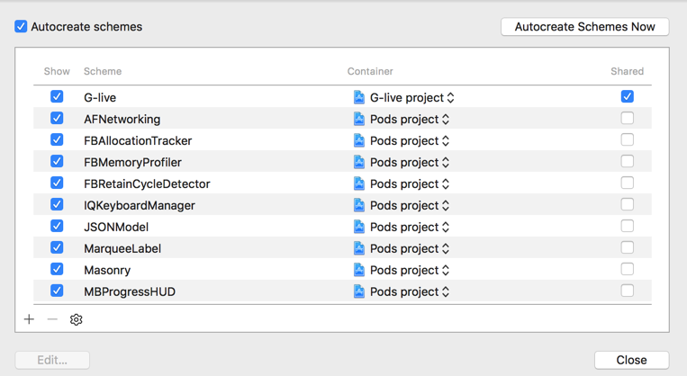
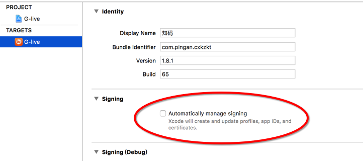

由于本人脚本不熟，项目组又没有其他的iOS开发相关人员，所以在自动化打包过程中踩到很多坑
<h2>打包的时候编译卡死</h2>
<p>jenkins构建包的时候，编译卡死，由于jenkins服务器部署在另一个职场，当时傻傻等待了1个小时还没编译完成。后来打电话问了jenkins相关专家，才知道编译的target必须设置为share,不然编译的时候会找不到targer,然后程序就卡在编译的时候不动了</p>

<h2>xcode工程配置要和脚本一致</h2>
先上传个脚本，这是我本地配置好的脚本

```
_VERSION="1.0"
# 修改后的版本号
T_VERSION="1.8.1"

# 原程序显示名称
S_APP_DISPLAY_NAME="产险空中课堂"
# 修改后成型显示名称
T_APP_DISPLAY_NAME="产险空中课堂"
# 设备类型
device="iPhone"
# 打包描述文件名称
PROVISION_PROFILE_NAME="682d7861-c689-45f6-ae5a-9d860dc0e4c2"
# 打包证书名称
CODESIGN_INDENTITY_NAME="iPhone Distribution: Shenzhen Flourishing Taoyuannetwork Technology Co., Ltd."
# APP ID
BUNDLE_IDENTIFIER="com.taoyuan.forTest"


#====================================== path ========================================
# 工作空间 （在不同机器上需要修改！！！）
workspace=`pwd`

#===================================== function =====================================
#获取包名后缀
function getPackageFix(){
    if [ "$env" == "prd" ];then
        echo "prd";
    elif [ "$env" == "int" ];then
        echo "int";
    elif [ "$env" == "stg" ];then
        echo "stg";
    fi
}

#获取网络框架环境
function getNetwork(){
if [ "$env" == "prd" ];then
    echo "2"
elif [ "$env" == "int" ];then
    echo "0"
elif [ "$env" == "stg" ];then
    echo "1"
fi
}

#获取时间戳，格式：yyyymmddHHMMSS
function getTime(){
    echo `date +%Y``date +%m``date +%d``date +%H``date +%M``date +%S`;
}

#获取时间戳，格式：yyyy-mm-dd HH:MM:SS
function getTimeFormat(){
    echo `date +%Y`-`date +%m`-`date +%d`_`date +%H`:`date +%M`:`date +%S`;
}

#获取时间，格式：mmddhhmm
function getTime_mmddhhmm(){
echo `date +%m``date +%d``date +%H``date +%M`
}

#获取设备类型简称
function getDeviceType(){
    if [ "$device" == "iPhone" ];then
        echo "h"
    elif [ "$device" == "iPad" ];then
        echo "a"
    fi
}

#获取版本号
function getVersion(){
    echo "v""$T_VERSION"
}

#======================================= common config ===================================
#工程路径
projectName="G-live"
projectTmpName="tmp"
projectBase=$workspace/$projectName

projectTmpBase=$workspace/$projectTmpName

#ipa包输出路径
outputName="output"
output=$workspace/$outputName

#编译参数
configuration="Release"
targetStr="G-live"
#iphoneos="iphoneos9.1"
iphoneos="iphoneos10.0"
IPHONEOS_DEPLOYMENT_TARGET="10"

#ipa名称
ipaMain="G-live"
ipaName=${ipaMain}-$(getPackageFix)-$(getVersion)-$(getTime).ipa
ipaShortName=$ipaMain.ipa
appName=$targetStr.app
DSYMName=$targetStr.app.dSYM

#===================================== 初始化 ======================================

cd $workspace
mkdir -pv $output
#静态代码扫描
#mkdir -pv $REPORT_DIRNAME
#mkdir -pv $REPORT_DIRNAME/$SCAN_BUILD_DIRNAME
cd $output
rm -rf $ipaShortName

#============================ 创建工程备份 ==========================================
cd $workspace
echo "remove project bak start..."
rm -rf $projectTmpName
echo "remove project bak end."

echo "make project bak start......"
cp -rf $projectName $projectTmpName
echo "make project bak end."

#======================================字符替换 start ===============================
#1.设置网络框架环境
#fn="MO_Global.h"
#cd $projectTmpBase/MobileOffice/公共/公共配置
#sed "s/#define PAMO_ENVIRONMENT.*\/\/网络框架环境/#define PAMO_ENVIRONMENT $(getNetwork) \/\/网络框架环境/g" $fn>1.h
#cat 1.h>$fn
#rm -rf 1.h

#echo "print $fn start..."
#cat $fn
#echo "print $fn end."

#2.修改Bundle identifier,app显示名,设置版本号
fn="Info.plist"
#cd $projectTmpBase/G-live
cd $projectTmpBase/${projectName}.xcodeproj
sed "s/<string>com.*<\/string>/<string>${BUNDLE_IDENTIFIER}<\/string>/g" $fn>1.plist
sed "s/<string>${S_APP_DISPLAY_NAME}<\/string>/<string>${T_APP_DISPLAY_NAME}<\/string>/g" 1.plist>2.plist
sed "s/<string>${S_VERSION}<\/string>/<string>${T_VERSION}<\/string>/g" 2.plist>3.plist
#sed "s/<string>${S_VERSION}<\/string>/<string>${T_VERSION}<\/string>/g" 3.plist>4.plist
cat 3.plist>$fn
#rm -rf 4.plist
rm -rf 3.plist
rm -rf 2.plist
rm -rf 1.plist
echo "print $fn start..."
cat $fn
echo "print $fn end."

#3、设置描述文件和签名
fn="project.pbxproj"
#cd $projectTmpBase
pushd $projectTmpBase/${projectName}.pbxproj
sed "s/PROVISIONING_PROFILE = \".*\"/PROVISIONING_PROFILE = \"${PROVISION_PROFILE_NAME}\"/g" $fn>1.pbxproj
sed "s/\"PROVISIONING_PROFILE\[sdk=iphoneos\*]\" = \".*\"/\"PROVISIONING_PROFILE\[sdk=iphoneos\*]\" = \"${PROVISION_PROFILE_NAME}\"/g" 1.pbxproj>2.pbxproj
sed "s/CODE_SIGN_IDENTITY = \".*\"/CODE_SIGN_IDENTITY = \"${CODESIGN_INDENTITY_NAME}\"/g" 2.pbxproj>3.pbxproj
sed "s/\"CODE_SIGN_IDENTITY\[sdk=iphoneos\*]\" = \".*\"/\"CODE_SIGN_IDENTITY\[sdk=iphoneos\*]\" = \"${CODESIGN_INDENTITY_NAME}\"/g" 3.pbxproj>4.pbxproj
cat 4.pbxproj>$fn
rm -rf 4.pbxproj
rm -rf 3.pbxproj
rm -rf 2.pbxproj
rm -rf 1.pbxproj
echo "print $fn start..."
cat $fn
echo "print $fn end."


#====================================== 编译与打包 ==========================================
#clean and compile
path="$projectTmpBase/build"
appPath="$projectTmpBase/build/$configuration-iphoneos/$appName"
ipaPathWithResigned="$projectTmpBase/${ipaName}"
cd $projectTmpBase
echo "clean start..."
#xcodebuild clean -configuration $configuration -target $targetStr
xcodebuild clean -workspace "${targetStr}.xcworkspace" -scheme $targetStr -configuration $configuration

echo "clean end."
echo "compile start......"
#xcodebuild -configuration $configuration -sdk $iphoneos -target $targetStr IPHONEOS_DEPLOYMENT_TARGET=$IPHONEOS_DEPLOYMENT_TARGET;
#xcodebuild archive -workspace "${targetStr}.xcworkspace" -scheme $targetStr -configuration $configuration IPHONEOS_DEPLOYMENT_TARGET=$IPHONEOS_DEPLOYMENT_TARGET -archivePath "${archivePath}"

xcodebuild -workspace $targetStr.xcworkspace -scheme $targetStr -sdk iphoneos -configuration $configuration build BUILD_DIR=$path BUILD_ROOT="${appPath}/" CODE_SIGN_IDENTITY="${CODESIGN_INDENTITY_NAME}"

echo "compile end."
echo "${appPath}"
echo "xcrun start......"
##xcodebuild -exportArchive -archivePath "${archivePath}" -exportPath "${ipaPathWithResigned}" -exportFormat ipa -exportProvisioningProfile "HaoSiJi_enterprise"
#xcodebuild -exportArchive -archivePath "${path}/G-live.xcarchive"  -exportPath "${ipaPathWithResigned}" -exportOptionsPlist "${projectTmpBase}/G-live/G-live.plist" -sdk iphoneos
#
#
xcrun -sdk iphoneos PackageApplication -v "${appPath}" -o "${ipaPathWithResigned}"
echo "xcrun end."
#
#
##====================================== 归档 ===============================================
#
#output the ipa file to special target
echo "move ipaFile to special target start......"

cd $output
timeDir=$(getTimeFormat)
if [ ! -d "$timeDir" ];then
mkdir $timeDir
fi

#归档.app,ipa,dSYM文件
cd $projectTmpBase
#cp -rf $ipaPathWithResigned $output/$timeDir/$ipaShortName
echo "${ipaPathWithResigned}"
cp -rf $ipaPathWithResigned $workspace

mv $ipaPathWithResigned $output/$timeDir
mv $projectTmpBase/build/$configuration-iphoneos/$appName $output/$timeDir
mv $projectTmpBase/build/$configuration-iphoneos/$DSYMName $output/$timeDir
echo "move ipaFile to special target done."

#删除.svn文件
cd $projectTmpBase
find . -type d -name ".svn" |xargs rm -rvf
#归档打包源码
cd ..
zip -r -T source.zip $projectTmpName
mv source.zip $output/$timeDir

#压缩所有归档文件
allReleaseZipName="Release_${T_VERSION}.zip"
cd $output
if [ -f "${allReleaseZipName}" ];then
    rm -rf ${allReleaseZipName}
fi
zip -r -T ${allReleaseZipName} $timeDir

```

红色标记的千万不要打钩，不然到时候证书没办法配置了，buddleID设置要与脚本一致
<h2>打包命令的选择</h2>
开始我是用archive命令生成archive包，用archive生成ipa成功了，但是格式不对，感觉ipa生成还是失败了，如果谁有通过这种方式生成ipa包成功了，<a href="mailto:291893562@qq.com">请联系我</a>

```
#xcodebuild archive -workspace "${targetStr}.xcworkspace" -scheme $targetStr -configuration $configuration IPHONEOS_DEPLOYMENT_TARGET=$IPHONEOS_DEPLOYMENT_TARGET -archivePath "${archivePath}"
```
```
#xcodebuild -exportArchive -archivePath "${path}/G-live.xcarchive"  -exportPath "${ipaPathWithResigned}" -exportOptionsPlist "${projectTmpBase}/G-live/G-live.plist" -sdk iphoneos

```
后来我编译的时候就采用build命令生成ipa成功了。

```
xcodebuild -workspace $targetStr.xcworkspace -scheme $targetStr -sdk iphoneos -configuration $configuration build BUILD_DIR=$path BUILD_ROOT="${appPath}/" CODE_SIGN_IDENTITY="${CODESIGN_INDENTITY_NAME}"
```

```
xcrun -sdk iphoneos PackageApplication -v "${appPath}" -o "${ipaPathWithResigned}"
```

<h2>错误查看和解决</h2>
<p>jenkins编译过程中会出现很多问题，例如在本地编译能够通过，然而通过jenkins打包ipa的时候会出现错误，如果解决呢？</p>
<p>1.一般服务器部署在某个主机上，可能主机和你不在同一个职场，建议先在本地进行调试成功后，在部署到服务器上</p>
<p>2.打包报错，只能通过日志来查询报错的原因，然后定位代码或者配置项的问题了</p>


