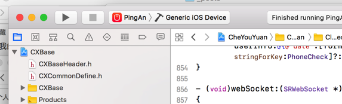

<h2>invalid bitcode signature</h2>

最近开发的时候遇到invalid bitcode signature报错，按照网上的<a href=http://blog.csdn.net/bobbob32/article/details/77008701>博客</a>对xcode各种配置还是没有解决这个问题。

指定某个模拟器和真机是可以编译通过的，但是不选择设备编译会包这个错误，分析了很久不知道什么问题

最后发现主工程和子工程的iOS Deployment Target不同，子工程是11.0，子工程是7.0，后来把他们的OS Deployment Targe都设置为7.0编译就能通过了 

