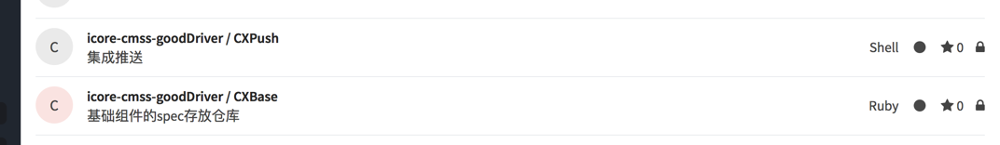
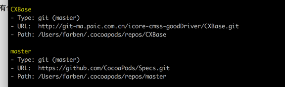
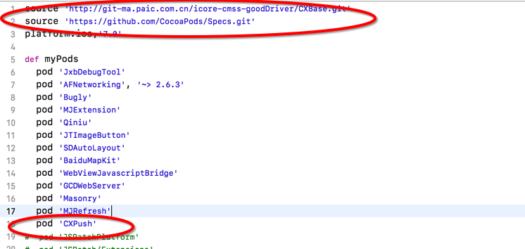

<h2>为什么要搭建私有库?</h2>
<p>在CocoaPods中可以通过podfile很好的配置各个组件，包括组件的增加和删除，以及控制某个组件的版本.使用CocoaPods的原因，很大程度是为了解决大型项目中，代码管理工具merge代码导致的冲突.并且可以通过配置podfile文件，轻松配置项目.
<p>
<p>每个组件都是一个独立app，可以独立开发、测试，使得业务组件更加独立，所有组件可以并行开发.下层为上层提供能满足需求的底层库，保证上层业务层可以正常开发.</p>
<p>私有库是保证组件化实现的基本技术要求</p>

<h2>创建cocopod的步骤</h2>
<p>a.创建一个spec Repo的私有远程仓库 和 一个存放pod所需的项目工程文件的远程仓库</p>
<p>b.创建spec Repo</p>
<p>c.创建pod的所需的项目工程文件，并上传到远程私有仓库</p>
<p>d.向私有的spec Repo远程仓库中提交podspec</p>
<p>e.使用自己创建的私有pod库</p>
<h3>在gitlab上创建私有库仓库</h3>
<p>一个用来存放spec文件，一个用来存放工程源码</p>

<h3>创建spec Repo</h3>
<p>通过终端创建repo仓库 pod repo add REPO_NAME  SOURCE_URL,查看repo是否创建成功，在终端运行pod repo list，是否列表中有REPO_NAME的repo</p>

<h3>创建pod的所需的项目工程文件，并上传到远程私有仓库</h3>
<h4>创建私有库代码</h4>

<p>使用“pod lib create 私有库名”+创建工程</p>

```
pod lib create CXPush
```


```
What language do you want to use?? [ Swift / ObjC ]
 > ObjC
Would you like to include a demo application with your library? [ Yes / No ]
 > Yes
Which testing frameworks will you use? [ Specta / Kiwi / None ]
 > None
Would you like to do view based testing? [ Yes / No ]
 > No
What is your class prefix?
 > CX
```

<h4> 对私有库用git进行版本管理</h4>

<h5>添加相应的资源文件和代码后将代码提交到对应的git仓库</h5>

```
git init
git remote add origin + Repo_Name
git add .
git  commit 
git push -u origin master
```

<h5>为项目添加tag标记用于版本管理</h5>

```
git tag '0.1.0'
git push --tags
```

<h4> 设置podspec文件</h4>

```
#
# Be sure to run `pod lib lint CXPush.podspec' to ensure this is a
# valid spec before submitting.
#
# Any lines starting with a # are optional, but their use is encouraged
# To learn more about a Podspec see http://guides.cocoapods.org/syntax/podspec.html
#

Pod::Spec.new do |s|
  s.name             = 'CXPush'
  s.version          = '0.1.0'
  s.summary          = '平安推送魔推'

# This description is used to generate tags and improve search results.
#   * Think: What does it do? Why did you write it? What is the focus?
#   * Try to keep it short, snappy and to the point.
#   * Write the description between the DESC delimiters below.
#   * Finally, don't worry about the indent, CocoaPods strips it!

  s.description      = "集成平安推送魔推"

  s.homepage         = 'http://git-ma.paic.com.cn/icore-cmss-goodDriver/CXBase'
  # s.screenshots     = 'www.example.com/screenshots_1', 'www.example.com/screenshots_2'
  s.license          = { :type => 'MIT', :file => 'LICENSE' }
  s.author           = { '291893562@qq.com' => '291893562@qq.com' }
  s.source           = { :git => 'http://git-ma.paic.com.cn/icore-cmss-goodDriver/CXPush.git', :tag => s.version.to_s }
  # s.social_media_url = 'https://twitter.com/<TWITTER_USERNAME>'

  s.ios.deployment_target = '7.0'
  s.vendored_libraries  = 'CXPush/Classes/ThirdParty/*.{a}'
  s.pod_target_xcconfig = { 'OTHER_LDFLAGS' => '-all_load' }

  s.source_files = 'CXPush/Classes/**/*'
  
  # s.resource_bundles = {
  #   'CXPush' => ['CXPush/Assets/*.png']
  # }

  # s.public_header_files = 'Pod/Classes/**/*.h'
  s.frameworks = 'CFNetwork', 'CoreFoundation', 'CoreTelephony', 'SystemConfiguration', 'CoreLocation', 'Foundation', 'UIKit','UserNotifications','UserNotificationsUI'
  # s.dependency 'AFNetworking', '~> 2.3'
end
```

<h3>  验证.podspec文件是否正确</h3>

```
pod lib lint CXPush.podspec --sources=REPONAME SOURCEURL --allow-warnings
```
<p></p>
验证成功后，私有库就创建成功了，在REPONAME SOURCEURL 也能看到CXPush.podspec的存在

<h2> 私有库如何使用 </h2> 
<p>使用的时候，在podfile中设置两个source，其中有一个指向私有库的仓库地址</p>



